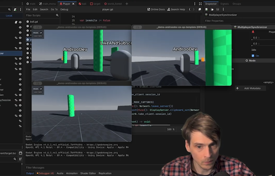

# AndrooDev Friendslop Co-Op Tutorial PART 2

The complete tutorial project from the [Godot Multiplayer Friendslop Co-Op Tutorial Part 2 on YouTube](https://www.youtube.com/watch?v=wgIqB6JNcro). Uses WebRTC via the Tube https://github.com/koopmyers/tube to make it easy to make a true peer-to-peer and play with your friends

|             Twitch             |              Youtube               |
| :----------------------------: | :--------------------------------: |
| https://www.twitch.tv/andoodev | https://www.youtube.com/@AndrooDev |

## Local Development:

- Clone this project
- Import in Godot 4.6
- You may need to disable Game Embed.
  - Open Godot menu -> Select Editor Settings
  - Search Embed
  - Window Placement
  - Game Embed Mode: Disabled
- Select Debug -> Select Customize Run Instances
  - Set 3 instances
- Play
  - Launched windows should tile
- Create session
- Join on client
- Join on client

|         Game Embed Mode: Disabled         |          Customize Run Instances          |
| :---------------------------------------: | :---------------------------------------: |
|  |  |

## Controls

- Tab to open menu
- WASD to Move
- Mouse to look
- Left Click to shoot ball
